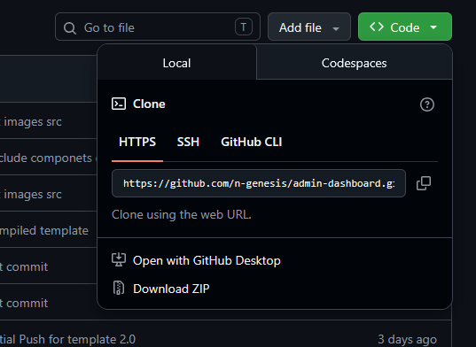

# Bootstrap Admin Dashboard Theme

A sleek and fully responsive **Bootstrap 5** Admin Dashboard Theme with swipe left event on mobile screens to display the offcanvas. It's a great starter-kit for developing a modern, user-friendly, and customizable feature-rich front-end for your web applications.


**[View Live Preview](https://admin-template.ngendesign.com/)**


[](https://opensource.org/licenses/MIT)

## ✨ Features
- Bootstrap 5 - Latest version with all modern utilities
- Responsive - Mobile-optimized layouts across all devices
    - Mobile Features
        - Touch-swipe for the offcanvas on mobile devices
- Dark/Light Mode
- Page loader/unloader

## 📝 Page Templates
- Dashboard
- Workspace
- Blank Page
- Directory (simple cards for directory list)
- Comonents Pages (Alerts, Buttons, & Toasts)
- Utilites Pages
    - Images, Typographyand, and Images
- Authentication Page
    - Login, register, and forgot password
- Error Pages
    - 401, 404, and 500
- ⭐ (New) Pages
    - App Page (Example landing page)


## 🚀 Quick Start
To begin using this template, choose one of the following options to get started:

### Download
You can download a zipped file of the repo by click the green "Code" button above and selecting "Download ZIP".  




### Clone the repo:
Open your terminal/cmd and navigate to the directory you want to clone to project and run the command:  

```
git clone https://github.com/n-genesis/ngen-admin-dashboard.git
```

Once you've downloading your copy, you can easily edit the HTML, CSS, and JavaScirpt files inside the `dist` directory. These are the only files you need to edit to make style and layout changes. You can ignore everything else if you don't wan't to get technical and what not. To checkout your the changes you make to the code, you can open the `index.html` file in your web browser.


## ⚙️ Advanced Usage

### Prerequisites
You must have [Node.js](https://nodejs.org) and NPM installed in order to use this build environment.

Clone the source files and navigate into the project's root directory. Run `npm install` and then `npm start`, this will open your default browser with a preview of the template and watch for changes to core template files, and live reload the browser when changes are saved. You can view the `package.json` file to see which scripts are included.


### 🛠️ Available Core Scripts

* `npm run build` builds the project - this builds assets, HTML, JS, and CSS into `dist`
* `npm run build:assets` copies the files in the `src/assets/` directory into `dist`
* `npm run build:pug` compiles the Pug located in the `src/pug/` directory into `dist`
* `npm run build:scripts` brings the `src/js/scripts.js` file into `dist`
* `npm run build:scss` compiles the SCSS files located in the `src/scss/` directory into `dist`
* `npm run clean` deletes the `dist` directory to prepare for rebuilding the project
* `npm start` or `npm run start` runs the project, launches a live preview in your default browser, and watches for changes made to files in `src`


### 📋 Documentation Architecture
For comprehensive deep dives, please refer to the following internal documentation files:

*   **[`OVERVIEW.md`](./OVERVIEW.md)**: Detailed folder layout trees, component breakdowns, custom build script logic pipelines, and system features.

## Bugs and Issues

Have a bug or an issue with this template? [Open a new issue](https://github.com/n-genesis/admin-dashboard/issues) here on GitHub.


## 📝 License

Copyright 2025 N-Gen Design This project is open-source software licensed under the [MIT License](./LICENSE).  


## 🎗️ Credits & Attribution

This template is built using open-source packages, asset frameworks, and community design resources.


### 📦 Third-Party Libraries
*   [Pug Engine](https://pugjs.org) — Structural HTML template generation.


### 🎨 Design References
*   [Simple Sidebar](https://github.com/startbootstrap/startbootstrap-simple-sidebar) created by Start Bootstrap is an off canvas sidebar navigation template.
*   [SB Admin](https://github.com/startbootstrap/startbootstrap-sb-admin) - An Admin dashboard template for Bootstrap created by Start Bootstrap.